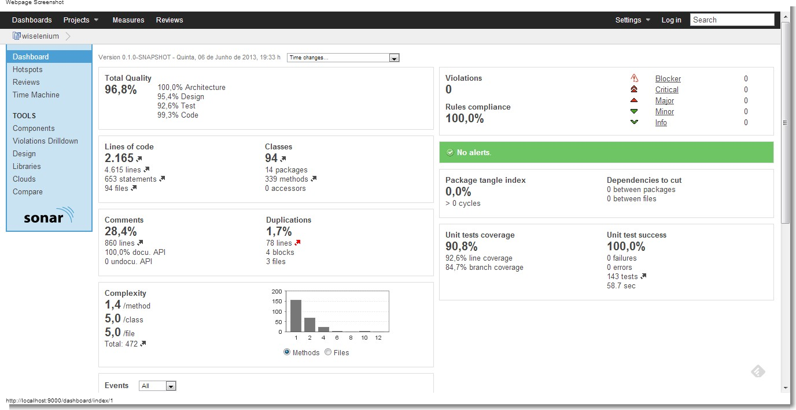

# What is wiselenium?

wiselenium is a framework built upon [Selenium WebDriver](http://seleniumhq.org/) to ease the creation of tests in a strongly typed manner.  
It makes it possible to easily create and use your own UI component types in your tests.

# 1 minute example

Suppose you want to test for the values within the "wiselenium table of features" below:

<table name="wiselenium-features">
    <tbody>
        <tr>
            <td>Provides strongly typed HTML elements with built-in methods</td>
            <td>Yes</td>
        </tr>
        <tr>
            <td>Lets you create and use your own UI elements</td>
            <td>Yes</td>
        </tr>
        <tr>
            <td>Removes the burden of handling frames with WebDriver</td>
            <td>Yes</td>
        </tr>
        <tr>
            <td>Supports the Page Object pattern</td>
            <td>Yes</td>
        </tr>
        <tr>
            <td>Adds convenience for test creation</td>
            <td>Yes</td>
        </tr>
    </tbody>
</table>
  
Then all you have to do is find the table and use its built-in methods for the test:

```java
public class GitHubExample extends WiseTestNG<GitHubExample> {
  
  @Test
  public void shouldTestWiseleniumTableOfFeatures() {
		this.get("https://github.com/andreschaffer/wiselenium");
		Table table = this.findElement(Table.class, By.name("wiselenium-features"));
		
		for (TableRow bodyRow : table.getBody().and().getRows())
			assertTrue(bodyRow.getCell(1).getText().contains("Yes"));
	}
  
}
```

## Setup

wiselenium will soon be deployed to the Maven Central Repository.

## The test class

wiselenium provides the WiseTestNG class to ease the configuration of your tests with the TestNG framework.

### The browser of the test
WiseTestNG will automatically open a browser on a beforeClass lifecyle and always close if afterClass. Firefox is the default browser, which can be changed in two ways:  
  
1) Override the `initDriver()` method to return the wanted browser.  
```java
@Override
public WebDriver initDriver() {
	return new FirefoxDriver();
}
```  

Note that wiselenium offers a `Driver` enum to help you instantiate the driver:
```java
@Override
public WebDriver initDriver() {
	return Driver.CHROME.initDriver();
}
```  
As known, Chrome and IE require the extra configuration of setting their exe drivers on your path (see [IE Driver wiki](https://code.google.com/p/selenium/wiki/InternetExplorerDriver)), but wiselenium `Driver` already does that for you.  
  
2) Pass in the browser as a parameter in the `testng.xml` ([TestNG documentation](http://testng.org/doc/index.html)).
```xml
<parameter name="browser" value="firefox"/>
```
The values must match a `Driver` enum value.

### The URL of the test
WiseTestNG can also navigate to a specific URL on a beforeClass lifecyle. For that, you can either override the `getUrl()` method or pass in the url parameter in the `testng.xml`.
```xml
<parameter name="url" value="http://www.google.com"/>
```

### The pages of the test
WiseTestNG will inject all page instance variables annotated with `@Page` for you.
```java
public class GitHubExample extends WiseTestNG<GitHubExample> {

	@Page
	private DummyPage page;
	
}
```

### The failure of a test
WiseTestNG will automatically take a screenshot of the browser screen when there's a test failure. You can change the directory to which the screenshots will be saved by overriding the method:
```java
public String getScreenShotPath() {
		return "target/tests-screenshots/"; // default value
}
```

### WiseTestNG methods
The WiseTestNG class provides a lot of convenient self-explanatory methods:  
`findElement(Class elementClass, By by)`, `initElements(Class pageClass)`, `get(String url)`, `getUrl()`, `takeScreenShot(String fileName)`.  
If these methods don't fulfill your needs, you can always get the original WebDriver from the `getDriver()` method and use as needed.

## Elements
An Element can be any type annotated with `@Field`, `@Container` or `@Frame` and must have a no-arg constructor.  
  - Field: an element that doesn't contain any other elements, like an input text.  
  - Container: represents an element that do contain others, like a table. wiselenium initializes every element inside a container in a lazy mode.  
  - Frame: represents a HTML frame.  wiselenium will automatically switchTo the frame scope before any of its methods is called, and switchTo the previous scope afterwards. It also initializes every element inside a frame in a lazy mode.  

When using wiselenium `findElements(...)` methods, you can pass an interface class. If so, it's implementation class will be automatically lookedup (check out wiselenium lookup strategy on the code javadoc).

### Element types
wiselenium offers you almost all of the HTML elements:  
`Text`,`Button`,`Hyperlink`,`Checkbox`,`Radiobutton`,`Img`,`Label`,`Select`,`MultiSelect`,`Table`,`Frame`, etc.

## The Page Object pattern
wiselenium supports the Page Object pattern and has its own factory `initElements(...)` methods.  
A page must have either a no-arg constructor or a constructor that takes a WebDriver as only argument. You don't have to start your pages from the zero, because wiselenium provides the `Page` base class that already fulfills this requirement and offers many other convenience methods. Just extend it!  
Its instance variables will be located the same way Selenium/WebDriver does, with the difference that it'll inject not just WebElements, but also wiselenium Elements.

### Page methods
The Page class provides many conveninent self-explanatory methods:  
`findElement(Class elementClass, By by)`, `initNextPage(Class<E> clazz)`, `executeScript(String script)`, `takeScreenShot(String fileName)`, `load()`, `isLoaded()`.  
`load()` and `isLoaded()` methods refer to the `LoadableComponent` interface. For more information, check [Selenium wiki](https://code.google.com/p/selenium/wiki/LoadableComponent).  
If these methods don't fulfill your needs, you can always get the original WebDriver from the `getWrappedDriver()` method and use as needed.

### @AjaxElement
Sometimes you have to wait for an element to be present, usually until an AJAX call completes. In these cases, wiselenium offers you the `@AjaxElement` annotation:
```java
public class DummyPage extends Page<DummyPage> {
	
	@AjaxElement(timeOutInSeconds=5) // default value
	private Button button;
	
}
```

## Create and use your Elements
Just annotate your element class, set a no-arg constructor and start using it with wiselenium!  
Note that wiselenium will always proxy your class and keep the original `WebElement`. To retrieve and use it, just call the `WiseUnwrapper.unwrapWebElement(...)` method passing in your element instance.  
Again, you don't have to start your element classes from the zero, as wiselenium provides base classes for them (Field/BasicField, Container/BasicContainer, Frame/BasicFrame).

## Frame usage
As stated in the table of features, wiselenium removes the burden of handling frames with WebDriver.  
Any Frame initialized with the wiselenium facilities will automatically and transparently handle its "switchTo" burden. So, lets say that you have a frame with an input text that you want to manage for example. You can either:  

1) Create your own Frame element:
```java
public class DummyFrame extends BasicFrame<DummyFrame> {

	private Text text;

	public void type(String value) {
		this.text.sendKeys(value);
	}
	
	public String getValue() {
		return this.text.getValue();
	}

}
```

```java
public class DummyTest extends WiseTestNG<DummyTest> {

	@Test
	public void shouldUseFrameTransparently() {
		DummyFrame frame = this.findElement(DummyFrame.class, By.name("frameName"));
		String value = "test";
		frame.type(value);
		assertEquals(frame.getValue(), value);
	}

}
```
As can be seen, once the frame was found, we could use its inner elements as if they were at the default scope!  
  
2) Find the frame as a `BasicFrame` and export the input text that is inside it:
```java
public class DummyTest extends WiseTestNG<DummyTest> {

	@Test
	public void shouldUseExportedTextTransparently() {
		BasicFrame frame = this.findElement(BasicFrame.class, By.name("frameName"));
		Text text = frame.findElement(Text.class, By.name("text"));
		String value = "test";
		assertEquals(text.sendKeys(value).and().getValue(), value);
	}

}
```
Note that the `Frame.findElement(...)` method just exported the input text so that it could be used transparently even outside the frame!  
As a matter of fact, the `BasicFrame` has a method called `exportInnerElement(E element)` that does just that. The trick is that its `findElement(...)` method makes use of the `exportInnerElement(E element)`.

# Code Health
wiselenium is developed with a real concern for code quality.  
This is [Sonar's](http://www.sonarsource.org/) wiselenium dashboard running with the default 'Sonar Way with Findbugs' profile, except for some rules regarding braces ('If Stmts Must Use Braces', etc).  


# About the developers

http://www.linkedin.com/in/andrericardoschaffer